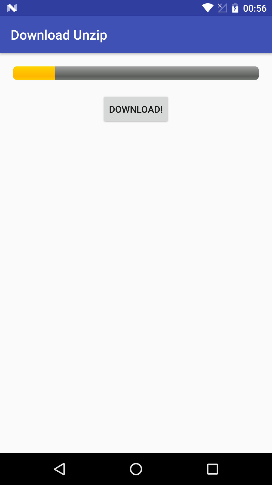

# DownloadUnzip

  
Android library helper for download zip files and unzip  

 

# Gradle
at the first step we need to add the library to our project
Add it in your root build.gradle at the end of repositories:

	   allprojects {
		   repositories {
			...
			maven { url 'https://jitpack.io' }
		 }
	
  
Add the dependency

	dependencies {
	        compile 'com.github.medmedchiheb:DownloadUnzip:1.0.1'
	}
# Permissions  
then we need to declare permissions in Manifest

    <uses-permission android:name="android.permission.INTERNET"></uses-permission>
    <uses-permission android:name="android.permission.WRITE_EXTERNAL_STORAGE"></uses-permission>
    <uses-permission android:name="android.permission.READ_EXTERNAL_STORAGE"></uses-permission>

# ProgressBar  
 add the ProgressBar on your Layout 
 
      <ProgressBar
        android:layout_margin="20dp"
        android:progress="0"
        android:id="@+id/progress"
        android:layout_width="match_parent"
        style="@android:style/Widget.ProgressBar.Horizontal"
        android:layout_height="wrap_content" />

# Setup          
make your Activity or Fragment implement interface DownloadListener

       public class MainActivity extends AppCompatActivity implements DowloadUnzip.DownloadListener{...
 
 instantiate the DowloadUnzip class and choose  the path of download you want, then set The Listener
 
        DowloadUnzip dowloadUnzip=new DowloadUnzip(Environment.getExternalStorageDirectory() + "/temp");
        dowloadUnzip.setDownloadListener(this);
        
  to download the zip file and unzip it on your path chosen should call  download method 
         
         dowloadUnzip.dowload("url_zip_file");
         
  finally we need to implement DownloadProgress method in our Activity
  
        @Override
        public void DownloadProgress(int event, int position) {
           if(event==3){

             //end of task
              Toast.makeText(this,"download and unzip finished",Toast.LENGTH_LONG).show();

           }else{
               progressBar.setProgress(position);
           }
       }
       
  as you can see the event is 3 when the task is reached and finish unzipping 

 
 # License
 

 <pre>Copyright 2017 octadev

Licensed under the Apache License, Version 2.0 (the "License");
you may not use this file except in compliance with the License.
You may obtain a copy of the License at

    http://www.apache.org/licenses/LICENSE-2.0

Unless required by applicable law or agreed to in writing, software
distributed under the License is distributed on an "AS IS" BASIS,
WITHOUT WARRANTIES OR CONDITIONS OF ANY KIND, either express or implied.
See the License for the specific language governing permissions and
limitations under the License.
</pre>

        
        
